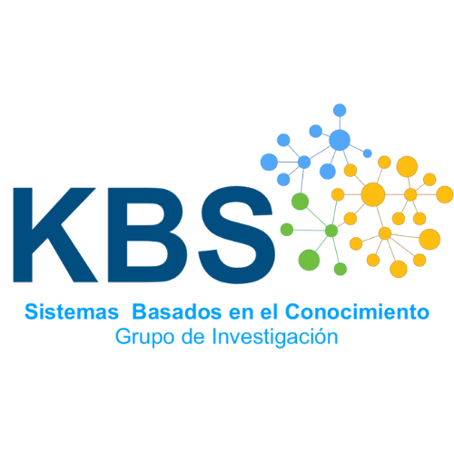

<!--
*** Thanks for checking out the Best-README-Template. If you have a suggestion
*** that would make this better, please fork the repo and create a pull request
*** or simply open an issue with the tag "enhancement".
*** Don't forget to give the project a star!
*** Thanks again! Now go create something AMAZING! :D
-->
<!-- PROJECT LOGO -->
 

  

<h3 align="center">Python-basico-06</h3>

  

    Primeros pasos en Python
     
     
     
 

 

 

  

  <h3>Instalar</h3>
<ul>
	<li>Instalar a través de pip install la librería mysql-connector-python</li>
	<li>Clonar el repositorio en sus máquinas locales</li>
	<li>Activar un entorno de python en sus máquinas locales</li>

</ul>

